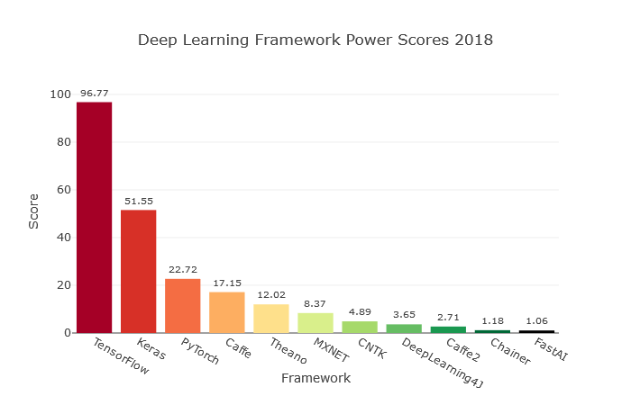

Introduction
============

.. toctree::
   :maxdepth: 2

Présentation de différentes bibliotèques
========================================

.. toctree::
   :maxdepth: 2

Numpy
*********

**Description**

Bibliotèques contenant plusieurs “outils” scientifiques notamment des tableaux multi-dimensionnels (numpy.array)
et des fonctions d’affichages graphiques (images, graphique…)

`source <http://www.numpy.org/>`_

Theano
***********

**Description**

LA “sous-couche” des autres bibliotèques d’apprentissages de réseaux de neurones. Comme tous les autres utilise des Numpy.arrays

`source <http://deeplearning.net/software/theano/index.html>`_

Pytorch
************

**Description**

Une des plus complètes des bibliotèques de Deep-Learning. Elle est complexe mais permet une grande flexibilité
et une personnalisation approfondie une fois les compétences acquises.

`source <https://pytorch.org/>`_

Keras
*********

**Description**

Sûrement la bibliotèque python la plus aimé car elle est simple d’utilisation sans pour autant brider les possibilités de programmation.
Seul point faible, la personnalisation est difficile à mettre en place.
Elle se programme sous forme de blocs, ce qui fait sa simplicité et réduit la longueur du code.

`source <https://keras.io/>`_

TensorFlow
***************

**Description**

TensorFlow est une bibliotèque open source développée  par une équipe de Google (Google Brain Team). Elle n'est pas seulement
utilisée par Google mais par beaucoup d'autres grandes entreprises(Twitter, Coca-Cola, Airbus...). Cette bibliotèque
peut-être utilisée pour plusieurs plateformes (ordinateurs, telephones, internet et cloud).

`source <https://www.tensorflow.org>`_

Comparaison de différentes bibliotèques
=======================================
.. toctree::
   :maxdepth: 2

Sur le site `towardsdatascience <https://towardsdatascience.com/deep-learning-framework-power-scores-2018-23607ddf297a>`_
une comparaison entre plusieurs bibliotèques python a été faite. Le score de chaque bibliotèque a été calculé en fonction
de critères tels que la fréquence de recherche google, l'activité GitHub ou bien le nombre d'articles qui en parle.

