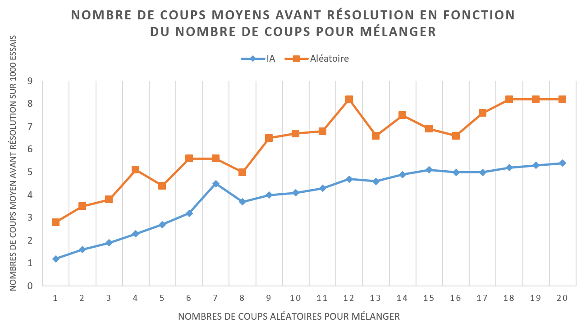

 .. title:: Notre programme

Introduction
============

~~~~~~~~~~~~

.. toctree::
   :maxdepth: 2

Notre but aura été de trouver les différentes méthodes de résolution de casse-têtes par algorithmes de deep-learning,
c’est à dire créer un outil utilisant le deep-learning et l’entraîner sur des données
correspondant à des situations que l’on peut rencontrer dans un casse-tête.

Il est avant tout important de noter que ce travail est un sujet de recherche.
Quand nous avons commencé la réalisation de ce projet, nous n’avions aucune idée de où cela allait nous mener.

Nos bases concernant ces système d’apprentissage étant quasi-inexistantes au commencement de ce projet,
il a été nécessaire de tenter de comprendre les différents modules mis à notre disposition
en réalisant des tutoriels de manipulation proposés par les équipes de développement ou
encore d’autres personnes proposant une explication guidée de l’utilisation de telle ou telle bibliothèque.
Vous pourrez retrouver tous les liens dans la `bibliographie <bibliographie.html>`_.
Il est aussi important de noter que certains modules complémentaires sont devenus indispensable
lors de l’utilisation de ces bibliothèques de Réseaux de Neurones et ont donc nécessité que l’on s’y intéresse
et apprenne à les manipuler (Matplotlib et NumPy notamment).

~~~~~~~~~~~~~~~~~~~~~~~~~~~

La méthode d’implémentation
===========================

~~~~~~~~~~~~~~~~~~~~~~~~~~~

.. toctree::
   :maxdepth: 2

Pour créer notre propre algorithme de Deep-Learning nous avons commencé par choisir
la méthode suivant laquelle nous allions fournir nos données à l’algorithme.
Comme mentionné dans `l'état de l'art <historique.html>`_ cette étape dans la création d’une méthode d’apprentissage par Deep-Learning est très importante.
Pour ce faire, nous nous sommes basé sur l’implémentation de Jeremy Pinto (`github de son projet <https://github.com/jerpint/rubiks_cube_convnet>`_)
pour concevoir notre générateur de données.

Son implémentation consiste en générer des partie aléatoires de Rubik’s cube en partant d’un état résolu
puis mélangé un certain nombre de fois (10 dans son cas). Après quoi il utilise le chemin vers l’état mélangé *Scrambled state*
pour trouver le chemin inverse vers la résolution.

En partant de l’état mélangé et en appliquant le premier mouvement du chemin vers la résolution,
il obtient l’état suivant de la matrice vers résolution, puis construit des pairs
(matrice (6x3x3 - 6 faces de 3 cellules en hauteur et 3 cellules en largeur) - mouvement),
la matrice correspondant à l’état mélangé du cube et le mouvement à celui qu’il faut effectuer pour atteindre un état de résolution plus proche du cube résolu.

Pour plus de clarté, voici le pseudo code du déroulement de la génération des données :

.. literalinclude:: ../Site/data/generate_data.pseudoc

Le but de son algorithme est de pouvoir entraîner la machine à, pour une certaine configuration du cube,
prédire le mouvement à effectuer pour se rapprocher de l’état résolu.
Il effectue donc ici un apprentissage supervisé en fournissant à chaque fois un état du cube
et son mouvement associé puis en demandant à son réseau de neurone de prédire le prochain mouvement à faire.
La rétropropagation se fait alors sur la comparaison entre le mouvement prédit et celui fourni.

Après 12h d’entraînement de son réseau de neurone, il parvient à obtenir un modèle capable de résoudre
avec un bon taux de réussite un Rubik’s cube mélangé 6 fois (6 pas de différence avec l’état résolu).
Le modèle n’est pas parfait et au delà de 6 mouvements aléatoires,
le NN ne parvient plus vraiment à trouver les solutions et fini souvent par répéter les même mouvements,
comme on peut le voir ci dessous.

.. image:: ../Site/pictures/cube_solving.gif
    :scale: 65%
    :align: center

Etant donné que cette implémentation était globalement la seule et unique
que nous avons pu relever au travers de nos recherches et qui paraissait adaptée à nos besoins,
le choix de la méthode de construction de notre propre réseau de neurone n’en a finalement pas été réellement un.
Nous avons donc commencé par construire notre propre jeu, puzzle numérique sur lequel
entraîner notre réseau de neurones tout en prenant compte du fait qu’il allait devoir
communiquer d’une certaine manière avec d’autre programmes de Machine Learning.
Le jeu que nous avons décidé de reproduire se nomme le Shift It. C’est un jeu qui fut
développé à l’origine sous Android mais qui à l’instant n’est plus disponible sur
les plateformes de téléchargement principales (Google Play Store) bien qu’il soit toujours possible
de le récupérer sous forme de fichier .apk sur certains hébergeurs.

~~~~~~~~~~~

Le Shift It
===========

~~~~~~~~~~~

.. toctree::
   :maxdepth: 2

Le Shift It se joue avec une grille comportant des carrés de plusieurs couleurs.
Le but est d’avoir une grille où toutes les cases de la même couleur formes une seul zone.
Il faut donc autant de zones que de couleurs et que chaque case soit adjacente avec
au moins une autre case de la même couleur.

Voici un visuel du jeu :

Exemple du Shift It sur Android
*******************************

Notre version du Shift It est composé d’une grille de taille et de nombre de couleurs modifiables
(pour l’instant le nombre de couleurs à été bloqué à 2). Pour l’apprentissage de notre modèle,
nous nous sommes fixé une taille de 5x5 et uniquement 2 couleurs différents.
Des configurations plus compliqués d’entraînement seront envisageables dans le futur.

Le noyau du jeu
***************

Nous avons commencé par créer une classe Python, correspondant à la partie fonctionnelle du jeu,
doté d’attributs permettants de stocker la hauteur et la largeur de la grille en plus de la grille elle-même
ainsi que le chemin de mouvements nécessaire à effectuer depuis l’état actuel pour obtenir l’état de résolution.
Elle conserve aussi une sauvegarde de son état résolu ainsi qu’un solveur qui utilise le modèle généré grâce au Deep Learning.

Les principales fonctionnalités du programme sont les suivantes :

* generate() : permet de générer aléatoirement une grille de jeu résolue.
* shuffle(n) : permet de sélectionner aléatoirement des mouvements et les appliquer,
  le paramètre n correspond au nombre de mouvements aléatoire appliqués.
  Cette méthode renvoie le chemin inverse de celui qui a été fait en mélangeant.
* shift(key) : permet d’effectuer le mouvement de la ligne ou de la colonne déterminé par la valeur key.
* solve_with_IA(limit) : permet de faire fonctionner le réseau de neurone sur l’état actuel de la grille
  pour prédire les mouvements à faire. Le paramètre limit correspond au nombre maximum de mouvement
  que doit prédire le réseau (s’avère plutôt utile lorsque le modèle ne parvient pas
  à atteindre la résolution, ce qui arrive souvent)
* reset() : permet de remettre la grille à son état résolu mais sans générer de nouvelle configuration.

Ainsi que les principales propriétés suivantes :

* width : largeur
* height : hauteur
* state: booléen indiquant si le jeu est résolu ou non
* moves : la liste des mouvements possibles en fonction de la grille

Les mouvements possibles sont représentés par des chaînes de caractères de longueur 2 ou 1.
Elles sont composées d’un entier désignant la ligne ou la colonne à faire défiler ainsi
que du caractère "‘" (apostrophe) désignant le sens de défilement.
Si le défilement est dans le sens normal (haut en bas pour la colonne et de gauche à droite pour la ligne)
alors la chaîne de caractères est uniquement composée du numéro de la ligne ou colonne.
Ce numéro désignant la ligne ou la colonne est un entier pair si l’élément sélectionné est une ligne et,
à l’inverse, est impair si c’est une colonne. La première ligne de la grille sera numéroté 0,
la deuxième ligne sera numéroté 2 et la troisième colonne sera numéroté 5 par exemple.
Ainsi le mouvement désigné par 9’ correspondra à un défilement de bas en haut
de la cinquième colonne de la grille. Sur une grille de NxM, il y aura alors (N+M)x2 mouvements
possibles soit 20 mouvements dans une configuration de 5 par 5.
Alors sur une grille de NxM, il y aura (N+M)x2 mouvements possibles soit 20 dans une configuration de 5 par 5.

Notre code est accessible au lien suivant : `GitHub <https://github.com/Staphir/TER_DeepLearning_L3_MIASHS>`_

~~~~~~~~~~~~~~~~~~~~~~

L’entraînement de l’IA
======================

~~~~~~~~~~~~~~~~~~~~~~

.. toctree::
   :maxdepth: 2

Afin d’entraîner notre programme d'intelligence artificielle, nous avions besoin de deux choses.
D’une part des données d’entrainements qui seront construites en utilisant l’implémentation de
notre Shift it et d’autre part du modèle dans lequel nous feront passer ces données.

La création des données d’entraînement
**************************************

Pour construire un set de données utilisables par un modèle d’apprentissage,
nous nous sommes inspiré de la méthode de Jeremy Pinto et avons généré de la même manière
que lui des pairs grille / mouvement, les grilles correspondant aux *features* et les mouvements aux *labels*.
Il est possible de passer directement le mouvement sous forme de chaîne de caractère
au système d’apprentissage mais dans notre cas nous avons simplifié cette information
en associant un indice à chaque mouvement. Ces sont ces indices qui sont fournis au système.

Premièrement, nous avons construit la méthode de génération de parties :

.. literalinclude:: ../Code/Jeux/Shiftit/train_shiftit_new.py
    :language: python
    :pyobject: generate_game

Cette méthode permet de créer un objet jeu (une instance de notre ShiftIt)
dans un état mélangé ainsi que le chemin vers succès associé (une liste de mouvements).
Ce couple d’élément est alors renvoyé par la méthode une fois qu’il est créé.

La méthode suivante consiste en, pour un couple d’éléments comme cités juste avant,
générer toutes les paires grille / mouvement comme expliqué plus tôt (algorithme en pseudocode).
De cette manière, si l’on mélange chacun des jeux en 10 coups, ils se verront tous associé
une liste de 10 pairs grille / mouvement correspondant aux états intermédiaires avec
les mouvements à effectuer pour passer à celui suivant.

.. literalinclude:: ../Code/Jeux/Shiftit/train_shiftit_new.py
    :language: python
    :pyobject: generate_game_data

Pour finir, la dernière méthode a été implémentée sous la forme d’un générateur Python
(`voir la documentation <https://wiki.python.org/moin/Generators>`_) et permet de renvoyer,
un nombre de fois définit par la variable *game_count*,
le traitement des éléments renvoyés par la première méthode au travers de la seconde.
Ainsi, nous créons un plus gros ensemble de pairs grille / mouvement
qui sont alors fournis séparément au modèle, avec d’un côté les grilles à partir desquelles
extraire les informations et prédire les mouvements et de l’autre, les mouvements correctes
vers lesquels les prédictions doivent tendre (utilisés pour la rétropropagation).

.. literalinclude:: ../Code/Jeux/Shiftit/train_shiftit_new.py
    :language: python
    :pyobject: data_generator

Le modèle d’entraînement
************************

Ici, le modèle d’entraînement fait référence à l’ensemble des couches utilisées
pour construire le réseau de neurone au complet, donc à l’*input layer*, l’*output layer*,
ainsi que les *hidden layers* qui viennent entre les deux.
Il est en généralement requis de dédier un temps relativement conséquent à son optimisation,
c’est à dire à savoir exactement quels types de layers implémenter et dans quel ordre.

Malheureusement, nous n’avons pas eu les connaissances nécessaires afin de pouvoir
mener cette étape à bien et de ce fait avons dû utiliser (et modifier) les modèles proposés par Jeremy Pinto
ainsi que d’autres que l’on a pu rencontrer au travers de différents tutoriels trouvés sur le net.
Il est d’ailleurs fort probable que ce fut la raison pour laquelle notre modèle
n’était pas en mesure de résoudre correctement même la plus simple des configuration que nous lui fournissions…

Ci-dessous le modèle que nous avons utilisé :

.. literalinclude:: ../Site/data/train_model.py
    :language: python

Ce modèle comme dit précédemment est basé sur un mixe des modèles utilisés par Jeremy Pinto
dans l’implémentation du Rubik’s Cube et de ceux que l’on a pu croiser au travers de tutoriels.
Ce modèle n’étant pas spécialement bien adapté à la situation, son taux de réussite selon l’entraînement
s’élève à approximativement 1 chance sur 3 de prédire le bon mouvement à un instant t du jeu,
ce qui est un score plutôt très moyen…

Voici les types de layers utilisés dans ce modèle :

* Conv2D : Un réseau convolutionnel en 2 dimensions qui permet l’extraction de données spatiales dans l’image
  (qui est ici une grille dont les cellules ont un seul canal, la couleur représentée par 0 ou 1).

* Activation :  Une couche de neurones qui applique une fonction d’activation à ce qui lui est envoyé.
  La fonction d’activation défini le seuil d’activation qui une fois atteint entraîne la réponse du neurone.

* Dense : Une couche de neurones qui comme son nom l’indique est densément interconnectée.

* Flatten : Une couche dont le but est de changer la dimension des données passées en entrée.

* Dropout : Une couche dont le but est d’empêcher l’overfitting (lorsque le modèle tend à
  coller aux données d’entraînement au lieu de les moyenner et donc perd en représentativité
  et en applicabilité aux données qui ne sont pas des données d’entraînement)

Afin de déterminer si le modèle construit avait ne serait-ce qu’un faible taux de réussite,
nous avons décidé de comparer ses performances face à un système utilisant uniquement des mouvements aléatoires.

Pour ce faire, nous avons d’abord établis le nombre maximum de mouvements m autorisés pour la résolution (fixé à 20)
puis avons ensuite pour chaque système (modèle de Deep Learning versus système aléatoire)
généré 1000 jeux différents que le système en question devait résoudre en gardant la trace,
si il y avait résolution, du nombre mouvement faits.

Performances du modèle
**********************

Afin de déterminer si le modèle construit avait ne serait-ce qu’un faible taux de réussite,
nous avons comparé ses performances face à un système utilisant uniquement des mouvements aléatoires.

Pour ce faire, nous avons d’abord établis le nombre maximum de mouvements autorisés pour la résolution (fixé à 20)

Cependant, les résultats semblent trop élevés selon nous par rapport aux performances que l’on a pu observé
en testant manuellement le modèles. Il est possible qu’il réside un biais dans notre manière de générer
les tests induisant alors un taux de succès beaucoup trop élevé en ce qui concerne l’IA.
Nous n’avons cependant pas réussi à mettre en évidence si un tel biais était présent ou
non dans notre algorithme. Tout cela pour bien faire remarquer que les données présentées ci-dessous
peuvent être biaisées et donc non représentatives.

Ci dessous la comparaison entre le nombres de mouvements aléatoires qui ont du être effectués
ainsi que le pourcentage de réussite associé sur 1000 essais :

On observe alors clairement une prévalence de l’IA quant à la résolution du jeu
et ce pour n’importe quel nombre de mouvements effectués lors du mélange.
Les performances du système produisant des mouvements aléatoires semble plutôt constante
tout au long des essais bien que l’on puisse observer une légère tendance négative.

Les performances de l’IA semble en outre être beaucoup plus affectés par le nombre de coups lors du mélange,
sa pente étant visuellement bien plus négative que celle du système aléatoire.

Ci-dessous sont représentés le nombre moyens de coups avant résolution par rapport
au nombre de coups effectués lors du mélange :

On observe ici aussi une nette différence de performance où l’IA tend à prédominer
avec un nombre moyen de coups globalement inférieur à celui du système aléatoire.
On notera aussi une information importante soulevée par ces données, le fait que
le nombre de coups effectués par l’IA soit beaucoup plus stable et varie moins lorsque comparé au système aléatoire.

Tous ces résultats nous invitent donc à penser que notre modèle est en effet capable de
prédire de bons mouvements étant donné que les résultats semblent logiques.
L’argument qui nous intéresse le plus ici est celui énoncé juste avant,
c’est à dire que le nombre moyen de mouvement fait par l’IA semble bien moins variable
comparé au système aléatoire, ce qui tend à montrer une certaine forme d’apprentissage,
à l’inverse du système aléatoire, ce qui est plutôt rassurant.

~~~~~~~~~~

Conclusion
==========

~~~~~~~~~~

Nous avons réussi à mettre en oeuvre un système de casse-tête numérique dans le but d’entraîner
un algorithme de Deep Learning à sa résolution. Bien que les résultats en ce qui concerne
les performances ne soient pas concluant, ils permettent de soulever les aspect difficiles
de la mise en place du début jusqu’à la fin d’un système utilisant le Deep Learning.
On relèvera la difficulté du choix de la manière suivant laquelle sont générées les données d’apprentissage,
comment les formater pour les fournir au modèle d’apprentissage ou encore comment créer et
optimiser le-dit modèle d’apprentissage.

Ce fut en termes générales une expérience très intéressante qui nous a permis
de nous rendre compte de l’important manque à gagner en ce qui concerne les différents types de layers
possibles pour optimiser le modèle créé. Nous nous sommes d’ailleurs tournés vers la communauté de StackOverflow
dans le but d’obtenir des conseils quant à la réalisation de notre projet
mais n’avons pour l’instant pas eu de suggestions.

